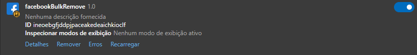

# Facebook Unfriend Bot

Projeto de bot personalizado para remover da lista de amigos automaticamente na plataforma do facebook, tendo diversas funcionalidades. Vale enfatizar que não há necessidade de conhecimento em programação para o download da extensão e ativação do bot

## Funcionamento

### Instalação e configuração da extensão
1. Copiar a pasta do repositório remoto para o repositório local
2. Acessar o seu navegador e clicar em 'Gerenciar extensões'. Habilitar o 'Modo do desenvolvedor' (no meu caso, utilizei o navegador Edge)
3. Clicar em 'Carregar sem pacote' e em seguida abrir a pasta do repositório local
4. Verificar se a extensão 'facebookUnfriend' está habilitada (conforme a imagem abaixo)

### Configuração do bot no facebook
1. Antes de qualquer coisa, abra o arquivo (urls.txt) e crie a lista com o link de todos os perfis do facebook para o bot não remover da lista de amigos.  Exemplo:
  - https://www.facebook.com/nilde.sizinia
  - https://www.facebook.com/misael.vitorinosilva.1
  - https://www.facebook.com/edvania.ferreirachaves
  
    Ou seja, pule uma linha para cada link, se preferir pode copiar e colar de uma planilha. Salve em 'Arquivo > Salvar' ou clique nas teclas 'Ctrl + S'. Sempre que atualizar este arquivo, salve, atualizar a extensão e atualizar a página do facebook.
1. Abrir o facebook e atualizar a página, clicando na tecla 'F5' localizada na parte superior do teclado
2. Na aba do perfil do facebook, clicar em 'Amigos'
3. Após a página estar totalmente carregada, clique na tecla 'F2'
4. Ao abrir a mensagem de pop-up, insira a quantidade de pessoas que o bot vai remover da lista de amigos e clique em 'Ok' ou aperte 'Enter'
5. Insira quantos segundos para durar cada ciclo de intervalo de tempo entre cada unfriend
6. O bot vai parar o funcionamento automaticamente nesses casos: ao atingir o limite de perfis que o bot removeu da lista de amigos, quando sair da tela de funcionamento ou quando o bot percorrer todos os perfis. O bot vai voltar a funcionar quando clicar na tecla 'F2' novamente
7. Ao atingir o limite de perfis removidos da lista de amigos, então vai aparecer a mensagem em pop-up perguntando se deseja realizar o download do arquivo (unfriendList.txt) que contêm o nome e URL do perfil que o bot removeu. É uma ótima maneira para revisar os perfis. Para quem quer algo ainda mais organizado, o bloco de notas em txt já vai estar com os dados espaçados, permitindo que ao copiar e colar em uma planilha fiquem organizados em colunas "Nome" e "URL"

## Observações

- O grupo Meta (facebook, instagram, whatsapp, messenger, etc.) tem restrições com o uso de bots, então use por conta e risco. 
- Uma recomendação, seria evitar deixar remover muitas pessoas na mesma hora. 
- O bot foi criado com o objetivo de diminuir as ações manuais, melhorar a organização e aumentar o tempo livre. Ou seja, sem objetivos maliciosos
- Deixe a página do facebook ativa enquanto o bot estiver em funcionamento, pois caso contrário, o bot pode não funcionar corretamente
- Não tem problema desligar o monitor enquanto o bot estiver em funcionamento, mas configure a economia de energia do seu PC para que a CPU não desligue sozinha por inatividade
- O bot foi testado em um sistema operacional Windows 10 Pro
- O idioma do facebook que o bot foi testado é o Português (Brasil). O bot pode não funcionar corretamente em outro idioma
- Em breve para ajudar na organização da lista de amigos, criarei o bot que pega todos os nomes e links do perfil para salvar em uma planilha ou bloco de notas
- O bot foi desenvolvido com uma variação entre cada ciclo do intervalo de tempo para assim se aproximar com o comportamento humano e evitar restrições da rede social
- Não há necessidade de utilizar o editor de código para configurar o bot, mas quem estiver interessado em contribuir realizando implementações, fique a vontade. Não se esqueça de dar uma estrela ao projeto
- Nos testes particulares, o bot não enfrentou restrições por parte da plataforma do Facebook, mesmo operando em intervalos de 1 segundo

## Contato

- E-mail: [jvnogueira2010@gmail.com](mailto:jvnogueira2010@gmail.com)
- LinkedIn: [www.linkedin.com/in/nogueira-jv](https://www.linkedin.com/in/nogueira-jv)
- GitHub: [www.github.com/jv-nogueira](https://github.com/jv-nogueira)